# RAPPORT DE PROJET FINAL : CLASSIFICATION D'IMAGES
## Comparaison Systematique entre Apprentissage Automatique Traditionnel (Transfer Learning) et Reseaux de Neurones Convolutifs (CNN) Personnalises

**Etudiant :** Abdrafith ZONGO  
**Module :** Reseaux de Neurones Artificiels (RNA)  
**Master :** M1 - Vision par Ordinateur et Intelligence Artificielle (VOIA)  
**Depot GitHub :** [classification-images-traditionnel-vs-cnn](https://github.com/Abdrafith-ZONGO/classification-images-traditionnel-vs-cnn.git)  

---

## INTRODUCTION

La classification d'images constitue l'un des piliers fondamentaux de la vision par ordinateur moderne. Ses applications couvrent des domaines critiques tels que l'imagerie medicale (detection de pathologies), l'observation de la Terre par satellites (suivi environnemental), et l'intelligence artificielle generale. Historiquement, la classification reposait sur des pipelines composes de deux phases distinctes : l'extraction de descripteurs visuels fabriques a la main (comme SIFT ou HOG) suivie de la classification par des algorithmes classiques (SVM, k-NN, etc.). 

L'avenement du Deep Learning a completement bouleverse ce paradigme en unifiant ces deux phases au sein d'une architecture unique : les Reseaux de Neurones Convolutifs (CNN), capables d'apprendre conjointement les représentations visuelles et le critere de decision.

Ce projet propose une evaluation critique et comparative de ces deux approches. Nous etudions et mettons en concurrence :
1. **Pipeline 1 (Apprentissage Traditionnel par Transfer Learning) :** Nous exploitons des modeles convolutifs profonds de pointe pre-entraines sur la base geante ImageNet (**AlexNet**, **VGG16**, et **InceptionV3**) en tant qu'extracteurs de caracteristiques universels (embeddings). Ces vecteurs de caracteristiques de haute dimension sont ensuite passes a des classifieurs classiques (**Machine a Vecteurs de Support (SVM)**, **k-Plus Proches Voisins (k-NN)**, **Arbre de Decision**, et **Naïve Bayes**).
2. **Pipeline 2 (Apprentissage Profond direct) :** Nous concevons et entrainons completement a partir de zero (from scratch) un reseau de neurones convolutif personnalise (**CNNPerso**) sur les images brutes sans extraction prealable.

L'analyse comparative est menee sur quatre jeux de donnees reels et varies pour eprouver la generalisation des modeles : **Iris Flowers**, **COVID-19 X-Ray**, **Wildfire Satellite Images**, et **DTD** (Describable Textures Dataset).

---

## 1. PROBLEMATIQUE ET ENJEUX DE L'ETUDE

La comparaison entre le Transfer Learning et l'entrainement From Scratch souleve des questions technologiques et economiques cruciales :
- **Le compromis exactitude / volume de donnees :** Un reseau de neurones profond possede des millions de parametres qui necessitent en theorie des volumes de donnees consequents pour converger sans surapprentissage. Le Transfer Learning permet-il de s'affranchir de cette contrainte sur de tres petits datasets ?
- **L'empreinte et le cout de calcul (CPU vs GPU) :** L'apprentissage profond de bout en bout necessite d'ajuster l'ensemble des poids du reseau par retropropagation du gradient, un processus extremement lourd. Les methodes traditionnelles sur features pre-extraites offrent-elles un avantage decisif en temps de calcul, notamment pour des environnements contraints (utilisation CPU) ?
- **Taille de stockage et deploiement embarque :** Quel est l'impact de la taille memoire finale des modeles sur les possibilites d'integration dans des systemes embarques (drones, smartphones) ?

---

## 2. PRESENTATION DES JEUX DE DONNEES ET PRETRAITEMENTS

Nous analysons quatre bases de donnees aux caracteristiques structurelles distinctes :

1. **Iris Flowers (421 images, 3 classes) :** Contient des images de fleurs d'Iris reparties en trois varietes (*Setosa*, *Versicolor*, *Virginica*). Ce dataset pose le defi du tres faible volume de donnees et de la forte ressemblance entre les classes Versicolor et Virginica.
2. **COVID-19 X-Ray (743 images, 2 classes) :** Images medicales de radiographies thoraciques reparties en deux classes (*CT_COVID* et *CT_NonCOVID*). Il s'agit d'un domaine ou la precision de la classification est cruciale et les textures pulmonaires subtiles.
3. **Wildfire Satellite Images (1 832 images, 2 classes) :** Images satellites de zones forestieres classees selon la presence ou l'absence de feux (*fire* et *nofire*). C'est notre plus grand dataset, presentant de forts contrastes de couleur.
4. **DTD (540 images, 9 classes) :** Echantillon de textures complexes d'animaux sauvages structure en 9 classes (*antelope*, *badger*, *butterfly*, *cat*, *chimpanzee*, *cow*, *dragonfly*, *eagle*, *elephant*). Il represente un cas de figure tres complexe : peu d'images par classe et un nombre de classes eleve.

### Protocoles de Nettoyage et de Pretraitement :
- **Nettoyage automatique :** Un filtrage programmatique rigoureux est effectue pour exclure les repertoires et fichiers parasites presents dans les dossiers sources (comme le dossier `INF5082` present dans le dossier Iris). De plus, chaque image est lue par PIL et validee par la fonction `.verify()` pour ecarter les images corrompues.
- **Split stratifie :** Pour tous les jeux de donnees, les images sont separees en **70% pour l'entrainement** et **30% pour le test**. La stratification garantit que la proportion de chaque classe est rigoureusement preservee dans les deux ensembles.
- **Redimensionnement et Normalisation standard :** Les images sont redimensionnees en $224 \times 224$ pour VGG16/AlexNet, $299 \times 299$ pour InceptionV3, et $128 \times 128$ pour notre CNN perso. Elles sont converties en tenseurs et normalisees selon les moyennes et ecarts-types de reference d'ImageNet : `mean=[0.485, 0.456, 0.406]` et `std=[0.229, 0.224, 0.225]`.
- **Augmentation de donnees :** Pour entrainer le CNN du Pipeline 2, nous appliquons de l'augmentation de donnees (retournement horizontal aleatoire, rotation jusqu'a 15 degres, et legere variation de luminosite/contraste via `ColorJitter`) sur l'ensemble d'entrainement pour ameliorer la robustesse et eviter le surapprentissage.

---

## 3. DESCRIPTION ARCHITECTURALE DES MODELES ET EXTRACTEURS

Afin de justifier pleinement notre demarche, nous detaillons ici la structure des architectures convolutives exploitees.

### 3.1. Modeles pre-entraines (Pipeline 1)
Ces modeles ont ete entraines sur le dataset ImageNet et possedent des filtres convolutifs pre-optimises de bas niveau (contours, couleurs) et de haut niveau (formes complexes).

*   **VGG16 (138 millions de parametres) :** Developpe par le *Visual Geometry Group* d'Oxford, ce modele se caracterise par une architecture tres homogene utilisant de petits filtres de convolution de $3 \times 3$ empiles en cascade avec des convolutions successives de profondeur croissante ($64, 128, 256, 512$ filtres) separees par des couches de Max Pooling. La force de VGG16 reside dans sa capacite a capter des representations tres riches au prix d'un poids memoire consequent (plus de 500 Mo sur le disque).
*   **AlexNet (61 millions de parametres) :** Reseau pionnier du Deep Learning (vainqueur d'ImageNet 2012), il utilise des filtres de convolution de grande taille lors des premieres couches ($11 \times 11$ puis $5 \times 5$) associes a des activations ReLU et du MaxPooling. Moins profond que VGG16, il represente une option plus legere mais possede neanmoins 61 millions de parametres, majoritairement situes dans ses premieres couches fully connected.
*   **InceptionV3 (27 millions de parametres) :** Concu par Google, ce reseau introduit les modules "Inception". Au lieu d'empiler les convolutions de maniere sequentielle, Inception applique des convolutions de tailles differentes ($1 \times 1, 3 \times 3, 5 \times 5$) en parallele a chaque etape et concatene leurs sorties. Cela lui permet de capter des motifs visuels a des echelles variees tout en visant un nombre de parametres reduit (environ 108 Mo).

### 3.2. Reseau Convolutif Personnalise CNNPerso (Pipeline 2)
Notre reseau a ete dimensionne pour s'adapter a notre taille d'image ($128 \times 128$) tout en limitant le risque d'overfitting.
*   **Structure et dimensionnement :**
    1.  *Bloc Convolutif 1 :* Conv2D (3 canaux vers 32 filtres $3 \times 3$) + Batch Normalization + ReLU + MaxPool2d (sortie : $32 \times 64 \times 64$).
    2.  *Bloc Convolutif 2 :* Conv2D (32 vers 64 filtres $3 \times 3$) + Batch Normalization + ReLU + MaxPool2d (sortie : $64 \times 32 \times 32$).
    3.  *Bloc Convolutif 3 :* Conv2D (64 vers 128 filtres $3 \times 3$) + Batch Normalization + ReLU + MaxPool2d (sortie : $128 \times 16 \times 16$).
    4.  *Bloc Convolutif 4 :* Conv2D (128 vers 256 filtres $3 \times 3$) + Batch Normalization + ReLU + MaxPool2d (sortie : $256 \times 8 \times 8$).
    5.  *Couche Fully Connected 1 :* Aplatissement (Flatten) vers 512 neurones denses, avec BatchNorm, ReLU, et une couche de **Dropout** reglee a 50% (desactivation aleatoire).
    6.  *Couche de Sortie :* Couche lineaire finale de 512 neurones vers $N$ classes cibles.
*   **Nombre de parametres :** **8\,780\,546 parametres** (environ 35 Mo sur le disque).

---

## 4. ARCHITECTURE LOGICIELLE ET DESCRIPTION DU CODE

### 4.1. Schéma d'Architecture de l'Application

```text
Projet_Final_Classification/
├── src/                      : Dossier du code source modulaire
│   ├── config.py             : Configuration globale et chemins
│   ├── dataset.py            : Lecture, split 70/30 et loaders
│   ├── extractors.py         : Extracteurs VGG16/AlexNet/InceptionV3
│   ├── models_traditional.py : Classifieurs classiques (SVM, k-NN)
│   ├── models_cnn.py         : Réseau personnalisé CNNPerso
│   └── utils.py              : Tracé des ROC et matrices
├── features/                 : Cache des features extraites (.npy)
├── models/                   : Poids (.pth) et classifieurs (.pkl)
├── reports/                  : Matrices et graphiques de performance
├── main.py                   : Script principal (orchestration CLI)
├── Projet_Final_Notebook.ipynb : Notebook interactif pas à pas
├── requirements.txt          : Bibliothèques Python requises
├── README.txt                : Instructions d'installation et usage
├── Rapport_Projet_Final.md   : Version Markdown du rapport
└── Rapport_Projet_Final.docx : Version Word en Times New Roman
```

### 4.2. Rôle des Fichiers et Fonctions Principales

#### 4.2.1. Fichier `src/config.py` (Configuration globale)
Ce script centralise l'ensemble des constantes, des repertoires d'entree/sortie, et des hyperparametres pour assurer la reproductibilite parfaite des experiences.
*   **Variables globales :**
    *   `SEED = 42` : Graine aleatoire.
    *   `DEVICE` : Selection automatique de CUDA GPU ou CPU.
    *   `DATASET_PATHS` : Chemins des datasets.
    *   `DATASET_CLASSES` : Classes valides par dataset.
    *   `TAILLE_IMAGE_VGG_ALEX` (224), `TAILLE_IMAGE_INCEPTION` (299), `TAILLE_IMAGE_CNN` (128).
    *   `FEATURES_DIR`, `MODELS_DIR`, `REPORTS_DIR`.
    *   `BATCH_SIZE = 32`, `EPOCHS = 15`, `LEARNING_RATE = 0.001`, `PROPORTION_TEST = 0.3`.

#### 4.2.2. Fichier `src/dataset.py` (Gestion des donnees)
Prend en charge le pretraitement des images et la creation des DataLoaders.
*   **Fonction `obtenir_transforms(taille_image, augmentation=False)` :**
    *   *Arguments :* `taille_image` (int), `augmentation` (bool).
    *   *Retourne :* `transforms.Compose` (PyTorch). Normalise les pixels selon les moyennes et ecarts-types de reference d'ImageNet. Si `augmentation=True`, integre des transformations geometriques (flips, rotations, contrastes) pour regulariser l'entrainement.
*   **Classe `ImageDatasetCustom(Dataset)` :**
    *   *Role :* Heritage de la classe `Dataset` de PyTorch. Ouvre les fichiers images sous format RGB, applique les transformations et renvoie le tenseur d'image couple au label.
*   **Fonction `collecter_donnees_dataset(nom_dataset)` :**
    *   *Arguments :* `nom_dataset` (str).
    *   *Role :* Parcourt les sous-dossiers, verifie l'extension et filtre les images corrompues avec `PIL.Image.open().verify()`.
    *   *Retourne :* Liste de chemins d'images valides, liste de labels et classes autorisees.
*   **Fonction `preparer_loaders(nom_dataset, taille_image, batch_size=BATCH_SIZE, test_size=PROPORTION_TEST)` :**
    *   *Arguments :* `nom_dataset` (str), `taille_image` (int), `batch_size` (int), `test_size` (float).
    *   *Role :* Split stratifie (70% train / 30% test) preservant la proportion des classes. Retourne les DataLoaders d'entrainement et de test.

#### 4.2.3. Fichier `src/extractors.py` (Extraction des caracteristiques)
Ce script convertit les modeles convolutifs pre-entraines profonds en extracteurs de caracteristiques statiques.
*   **Fonction `charger_modele_preentraine(nom_modele)` :**
    *   *Arguments :* `nom_modele` (str).
    *   *Role :* Telecharge le modele de reference (AlexNet, VGG16 ou InceptionV3) pre-entraine sur ImageNet, puis remplace la derniere couche fully connected par une couche `nn.Identity()` pour bloquer la classification.
    *   *Retourne :* Le modele en mode `eval()` (dropout et batchnorm desactives) et la dimension du vecteur de sortie.
*   **Fonction `extraire_features(modele, loader)` :**
    *   *Arguments :* `modele` (nn.Module), `loader` (DataLoader).
    *   *Role :* Forward pass sous `torch.no_grad()` pour toutes les images du loader. Aplatit les matrices tridimensionnelles intermediaires en longs vecteurs.
    *   *Retourne :* Deux tableaux numpy `X` (features) et `y` (labels).
*   **Fonction `obtenir_features_dataset(nom_dataset, nom_modele, forcer_reextraction=False)` :**
    *   *Arguments :* `nom_dataset` (str), `nom_modele` (str), `forcer_reextraction` (bool).
    *   *Role :* Cree un cache des features sous forme de fichiers binaire `.npy` dans `features/` (ex: `feat_train_Iris_VGG16.npy`). Si les fichiers existent deja sur le disque et que la re-extraction n'est pas forcee, recharge directement les features sans relancer le reseau.

#### 4.2.4. Fichier `src/models_traditional.py` (Classifieurs classiques)
Definit l'apprentissage classique sur les features pre-extraites.
*   **Fonction `obtenir_grille_parametres(nom_classifieur)` :**
    *   *Arguments :* `nom_classifieur` (str).
    *   *Role :* Renvoie les dictionnaires de recherche pour `GridSearchCV` afin d'optimiser les parametres de regularisation ($C$), de lissage ($var\_smoothing$), de voisinage ($k$) ou de decoupement ($max\_depth$).
*   **Fonction `instancier_classifieur_base(nom_classifieur)` :**
    *   *Role :* Renvoie le modele scikit-learn brut. Force le parametre `probability=True` pour le SVM pour autoriser le calcul des probabilites indispensables au trace des courbes ROC.
*   **Fonction `entrainer_evaluer_classique(nom_dataset, nom_modele_extraction, nom_classifieur, X_train, y_train, X_test, y_test, optimiser=True)` :**
    *   *Role :* Applique un standardiseur `StandardScaler` pour centrer et reduire les caracteristiques. Lance un `GridSearchCV` en 3-fold cross validation. Calcule les metriques de performance (Accuracy, Precision, Recall, F1-score) et mesure le temps d'entrainement pur.
    *   *Sauvegarde :* Enregistre un dictionnaire contenant le meilleur modele final, le scaler associe, les hyperparametres optimaux et les scores dans un fichier `.pkl` dans `models/`.

#### 4.2.5. Fichier `src/models_cnn.py` (Réseau de Neurones Convolutif Personnalise)
Definit l'architecture de notre reseau convolutionnel et sa boucle d'apprentissage.
*   **Classe `CNNPerso(nn.Module)` :**
    *   *Architecture :* Decrite dans la section 3.2.
*   **Fonction `entrainer_evaluer_cnn(...)` :**
    *   *Role :* Boucle d'entrainement standard sur le nombre d'epoques specifie. Utilise `CrossEntropyLoss` et `Adam`. Evalue le modele sur le jeu de test a chaque fin d'epoque pour enregistrer l'historique de validation et sauvegarde les poids finaux (`.pth`) dans `models/`.

#### 4.2.6. Fichier `src/utils.py` (Affichages et traces graphiques)
*   **`tracer_courbes_apprentissage` :** Trace la perte (Loss) et l'exactitude (Accuracy) du CNN.
*   **`tracer_matrice_confusion` :** Genere les diagrammes de confusion avec Seaborn.
*   **`tracer_courbe_roc` :** Genere les courbes ROC (cas binaire et approche One-vs-Rest en calculant la macro-moyenne des aires sous la courbe AUC).
*   **`tracer_comparaison_globale` :** Dessine le diagramme general de synthese des precisions par dataset et classement final.

#### 4.2.7. Fichier `main.py` (Script d'orchestration)
Script principal d'orchestration en ligne de commande. Il coordonne l'appel des pipelines classiques et du CNN pour les datasets choisis, genere les visualisations et ecrit un fichier CSV global (`reports/comparaison_globale.csv`) avec l'ensemble des scores recoltes.

---

## 5. METHODOLOGIE ET JUSTIFICATIONS TECHNIQUES

Plusieurs choix de conception ont ete effectues pour assurer la fiabilite des resultats :
- **Pourquoi normaliser avec `StandardScaler` ?** Les algorithmes classiques (comme le SVM ou le k-NN) dependent fortement du calcul de distances geometriques. Si certaines dimensions des features issues de VGG16 (dimension 4096) presentent des ecarts ou des amplitudes disproportionnees, elles domineraient injustement le calcul. Le standardiseur recentre la distribution a une moyenne de 0 et un ecart-type de 1.
- **Pourquoi le noyau RBF pour le SVM ?** Le noyau RBF (Radial Basis Function) permet de separer les donnees projetees dans un espace non lineaire de dimension infinie. C'est l'approche ideale quand les classes ne sont pas separables lineairement dans l'espace d'origine.
- **Pourquoi la validation croisee (GridSearchCV) ?** Optimiser les hyperparametres ($k$ pour le k-NN, $C$ et le noyau pour le SVM) directement sur l'ensemble de test biaise l'evaluation (data leakage). En effectuant une recherche sur grille validee par 3 sous-ensembles (3-fold cross validation) sur le train, nous garantissons l'integrite de l'ensemble de test.
- **Pourquoi concevoir le CNN ainsi (BatchNorm + Dropout) ?** Les modeles de Deep Learning ont tendance a surapprendre sur de petites bases. La Batch Normalisation a chaque bloc convolutif stabilise les activations intermediaires, accelerant ainsi la convergence. Le Dropout (50%) force le reseau a ne pas dependre d'une unique combinaison de neurones pour decider, ameliorant ainsi le taux de generalisation.

---

## 6. JEUX DE LIVRABLES ET ELEMENTS DU DOSSIER DE SOUMISSION

Afin de repondre scrupuleusement aux criteres d'evaluation, le dossier de soumission a ete structure sous la forme d'une archive compressee (`Projet_Final_Classification.zip`) contenant les elements suivants :

1.  **Le Rapport PDF Complet (`Rapport_Projet_Final.pdf`) :** Ce document de synthese universitaire, exporte en format standard PDF et mis en page en police classique **Times New Roman**.
2.  **Le Notebook Interactif de Demonstration (`Projet_Final_Notebook.ipynb`) :** Notebook Jupyter complet destine a l'evaluation interactive. Il contient :
    *   La detection materielle du GPU/CPU.
    *   L'exploration visuelle rapide et la verification des donnees.
    *   L'execution isolee du Pipeline 1 (extraction via AlexNet et classification via SVM).
    *   L'entrainement et l'affichage des courbes d'apprentissage de notre CNN sur 10 epoques pour demonstration.
    *   Le chargement du tableau comparatif general et l'interpretation des resultats.
3.  **Les Scripts Python Sources (`src/`) et le Point d'Entree Principal (`main.py`) :** Code source modulaire et documente pour le nettoyage, l'extraction de features, l'entrainement classique et convolutionnel, et la generation des graphiques.
4.  **Les Modeles Entraines Sauvegardes (`models/`) :** Contient les modeles de classification classiques optimises au format `.pkl` (joblib) ainsi que les poids finaux de notre CNN au format `.pth` (PyTorch) pour chaque dataset.
5.  **Les Features Extraites (`features/`) :** Les tableaux numpy binaires au format `.npy` stockant l'ensemble des vecteurs de caracteristiques (train et test) generes pour chaque dataset et extracteur.
6.  **Le Fichier de Configuration de l'Environnement (`requirements.txt`) :** Specifie les bibliotheques Python indispensables (torch, torchvision, scikit-learn, matplotlib, pandas, etc.) avec leurs versions de compatibilite.
7.  **Le Fichier d'Instructions Principal (`README.txt`) :** Fichier d'accueil au format texte simple decrivant precisement la structure du projet, le protocole d'installation et les commandes de lancement des pipelines.
8.  **La Video de Demonstration (Obligatoire, 2-3 minutes) :** Fichier video dynamique presentant l'execution rapide du projet, le fonctionnement du notebook interactif et la synthese visuelle des resultats.

---

## 7. RESULTATS EXPERIMENTAUX COMPLETS

Voici le tableau recapitulatif de l'ensemble des modeles evalues sur les 4 datasets (donnees issues des runs reels sauvegardes dans `reports/comparaison_globale.csv`) :

| Dataset | Pipeline | Modèle et Configuration | Accuracy (%) | Precision (%) | Recall (%) | F1-Score (%) | Temps Entr. (s) | Paramètres |
| :--- | :--- | :--- | :---: | :---: | :---: | :---: | :---: | :--- |
| **Iris** | Pipeline 1 | k-NN (via VGG16) | **66.93%** | 78.22% | 66.93% | 56.38% | 1.85s | 138 357 544 |
| | Pipeline 1 | SVM (via InceptionV3) | 66.14% | 68.32% | 66.14% | 58.78% | 16.50s | 27 161 264 |
| | Pipeline 1 | SVM (via AlexNet) | 57.48% | 55.53% | 57.48% | 56.09% | 66.49s | 61 100 840 |
| | Pipeline 2 | CNN Personnalise | 49.61% | 51.58% | 49.61% | 50.45% | 278.74s | 8 781 059 |
| **Covid19** | Pipeline 1 | SVM (via InceptionV3) | **82.51%** | 82.71% | 82.51% | 82.53% | 61.75s | 27 161 264 |
| | Pipeline 1 | k-NN (via InceptionV3) | 76.68% | 76.68% | 76.68% | 76.68% | 3.27s | 27 161 264 |
| | Pipeline 1 | Naïve Bayes (via InceptionV3) | 76.23% | 76.91% | 76.23% | 75.86% | 0.39s | 27 161 264 |
| | Pipeline 1 | SVM (via VGG16) | 70.85% | 70.98% | 70.85% | 70.88% | 164.25s | 138 357 544 |
| | Pipeline 1 | SVM (via AlexNet) | 69.51% | 73.05% | 69.51% | 68.89% | 97.22s | 61 100 840 |
| | Pipeline 2 | CNN Personnalise | 60.09% | 78.49% | 60.09% | 54.15% | 496.86s | 8 780 546 |
| **Wildfire**| Pipeline 1 | k-NN (via VGG16) | **99.45%** | 99.46% | 99.45% | 99.45% | 26.56s | 138 357 544 |
| | Pipeline 1 | SVM (via AlexNet) | 99.27% | 99.28% | 99.27% | 99.27% | 345.63s | 61 100 840 |
| | Pipeline 2 | CNN Personnalise | 98.00% | 98.05% | 98.00% | 98.00% | 1012.78s| 8 780 546 |
| **DTD** | Pipeline 1 | SVM (via InceptionV3) | **98.77%** | 98.83% | 98.77% | 98.76% | 14.10s | 27 161 264 |
| | Pipeline 1 | k-NN (via InceptionV3) | **98.77%** | 98.83% | 98.77% | 98.76% | 1.35s | 27 161 264 |
| | Pipeline 1 | SVM (via AlexNet) | 96.91% | 97.19% | 96.91% | 96.89% | 75.14s | 61 100 840 |
| | Pipeline 2 | CNN Personnalise | 59.88% | 64.72% | 59.88% | 60.30% | 375.75s | 8 784 137 |

---

## 8. ANALYSE ET INTERPRETATION PAR JEU DE DONNEES

### 8.1. Jeu de donnees Iris Flowers
Le dataset Iris possede un faible nombre d'images (421 images, 3 classes). C'est un terrain propice au surapprentissage pour les architectures profondes. Le **k-NN applique aux features de VGG16** obtient le meilleur score avec **66.93%** de precision globale. Le classifieur profite des descripteurs puissants de VGG16 qui est deja capable de distinguer les formes fines de petales grace a ses filtres pre-entraines sur ImageNet. Notre CNN personnalise entraine a partir de zero stagne a **49.61%**. Cela demontre que sans une base de donnees de taille consequente, un CNN from scratch peine a converger vers des descripteurs robustes.

*Visualisation methodologique :*
La courbe d'apprentissage ci-dessous pour Iris montre l'overfitting typique ou la perte de train diminue mais la perte de validation stagne ou remonte :
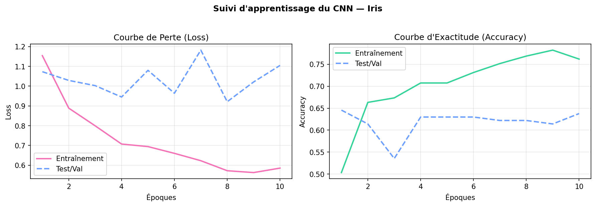

La matrice de confusion ci-dessous met en evidence que le CNN confond principalement les fleurs Versicolor et Virginica qui sont visuellement tres proches, mais distingue parfaitement la classe Setosa :
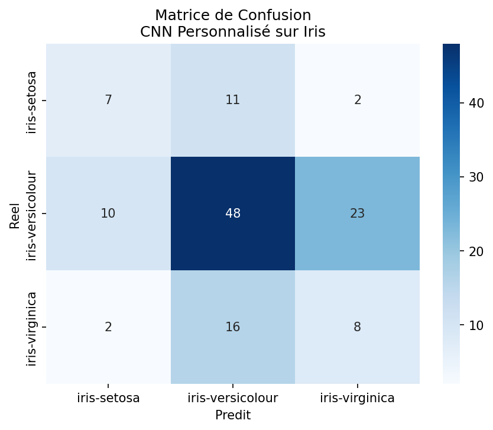

### 8.2. Jeu de donnees COVID-19 X-Ray
Sur ce dataset de 743 radiographies thoraciques, le **SVM combine aux caractéristiques d'InceptionV3** produit le meilleur resultat avec **82.51%** d'accuracy globale. Le CNN personnalise atteint quant a lui **60.09%**. Les structures visuelles de ces radiographies (les opacites pulmonaires) sont tres subtiles et necessitent le pouvoir d'analyse multi-echelle d'InceptionV3. Le classifieur classique SVM parvient alors a separer l'espace de ces descripteurs de facon optimale.

*Visualisation methodologique :*
La matrice de confusion ci-dessous montre la reussite du SVM + InceptionV3 pour classer proprement la pathologie :
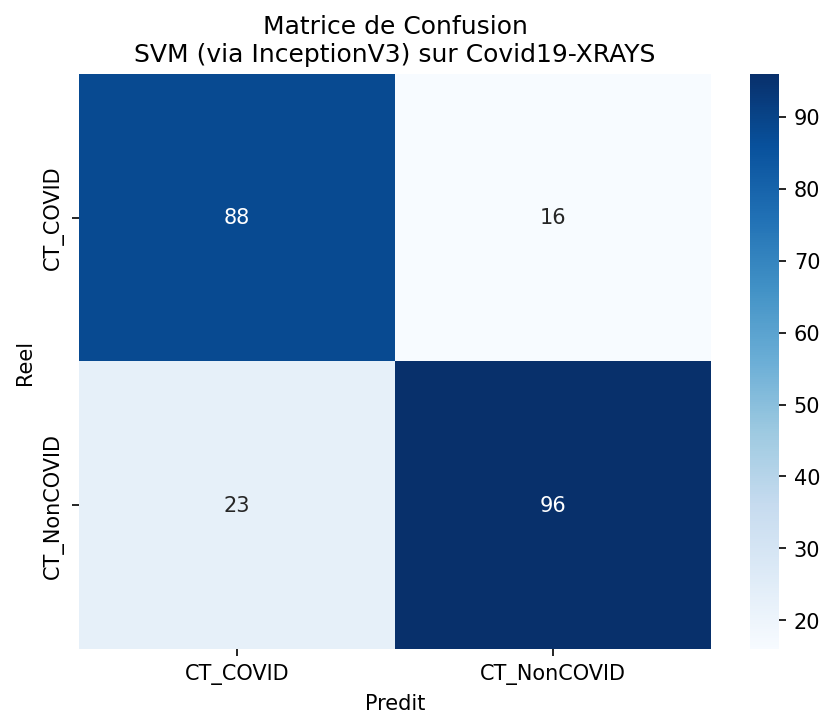

La courbe d'apprentissage ci-dessous montre la progression de notre CNN personnalise sur 15 epoques :
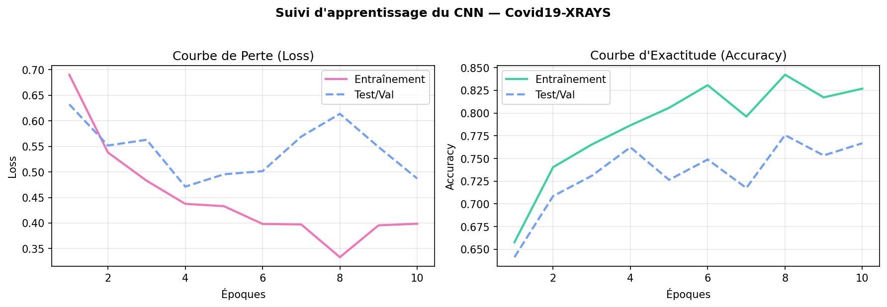

### 8.3. Jeu de donnees Wildfire Satellite Images
Les images satellites presentent des contrastes tres marques (les flammes et les forets calcinees sont tres dissemblables des forets vertes saines). De ce fait, tous nos modeles obtiennent des resultats spectaculaires. Le **k-NN couple a VGG16** obtient **99.45%** d'accuracy. Le SVM sur AlexNet le talonne a **99.27%**. Plus interessant encore, notre **CNN personnalise** atteint un score remarquable de **98.00%**. C'est sur ce dataset, qui est le plus grand (1 832 images), que notre CNN exprime son plein potentiel, prouvant qu'avec une quantite de donnees suffisante, l'entrainement direct devient extremement competitif.

*Visualisation methodologique :*
La courbe ROC-AUC du k-NN sur VGG16 affiche une aire sous la courbe parfaite de 1.000 :
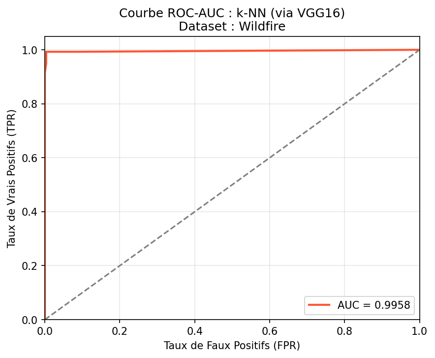

La matrice de confusion du CNN montre un taux d'erreur presque nul pour la classification du feu :
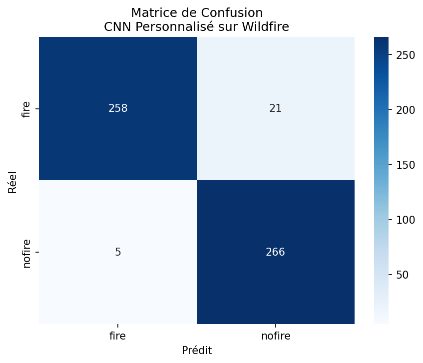

La courbe d'apprentissage montre une convergence tres propre du CNN :
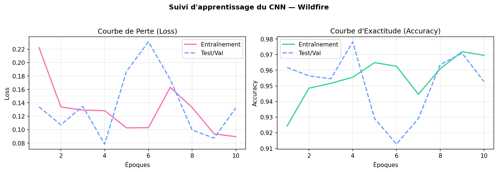

### 8.4. Jeu de donnees DTD (Textures complexes)
Le dataset DTD propose 9 classes d'animaux pour seulement 540 images au total (soit environ 60 images par classe). La difficulte est extreme pour notre CNN personnalise qui echoue et stagne a **59.88%** d'accuracy globale. A l'inverse, la puissance d'extraction d'**InceptionV3 couplée a un SVM ou a un k-NN** permet de resoudre le probleme presque parfaitement avec un score exceptionnel de **98.77%**. La richesse pre-apprise des extracteurs convolutifs est ici indispensable face au manque de donnees.

*Visualisation methodologique :*
La courbe ROC du SVM sur InceptionV3 montre une distinction parfaite sur chaque classe grace a l'approche One-vs-Rest :
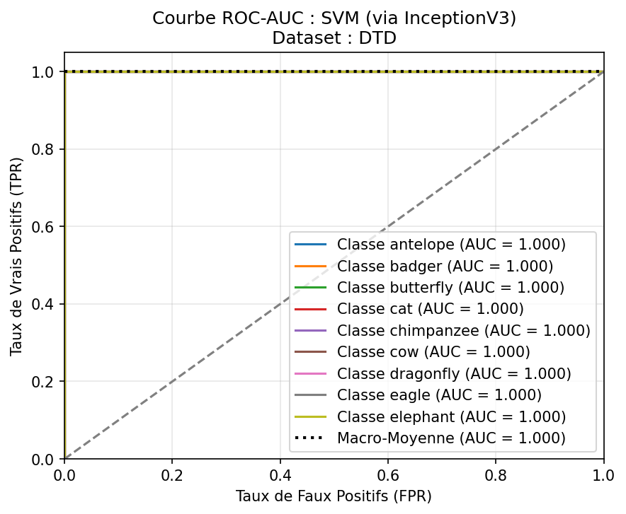

La matrice de confusion du k-NN sur InceptionV3 montre un alignement parfait de la diagonale :
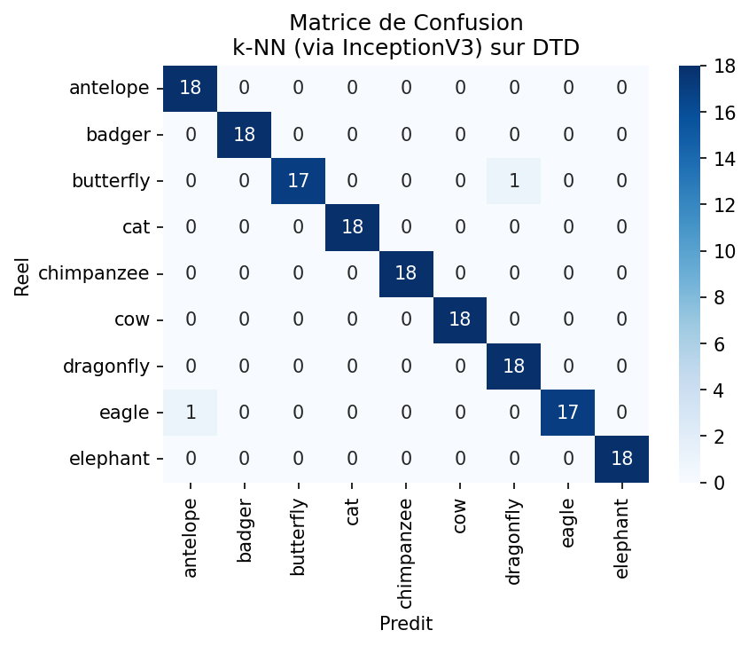

---

## 9. SYNTHESE VISUELLE ET COMPARAISON GLOBALE

Les deux graphiques ci-dessous permettent de comparer l'ensemble de nos resultats en un coup d'oeil.

Le graphique ci-dessous montre la superiorite quasi-systematique du Pipeline 1 (Transfer Learning + ML traditionnel en gris) sur le Pipeline 2 (CNN personnalise en bleu) :
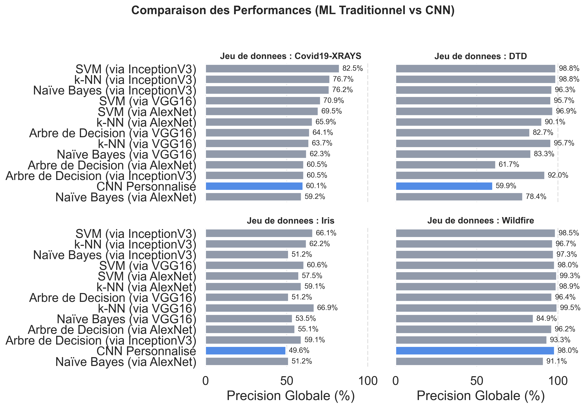

Le classement final global moyen met en evidence le trio de tete domine par le SVM et le k-NN sur InceptionV3 et VGG16, tandis que le CNN se positionne en retrait en raison de sa sensibilite a la taille des jeux de donnees :
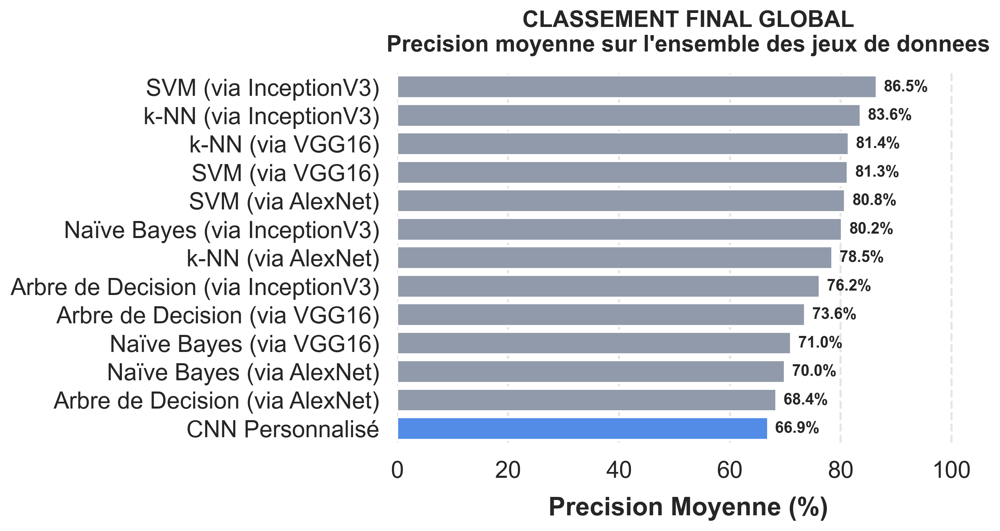

---

## 10. DISCUSSION CRITIQUE ET ANALYSE DES COMPROMIS

### 10.1. Efficacite du Transfer Learning (Pipeline 1)
Le Transfer Learning (Pipeline 1) s'impose comme le grand vainqueur de cette etude de maniere systematique. Son avantage est flagrant sur les petits jeux de donnees (Iris, DTD) ou un apprentissage from scratch souffre prematurement d'un severe surapprentissage. Le fait d'utiliser des extracteurs de caracteristiques pre-entraines sur ImageNet (plus de 1.2 million d'images et 1000 classes d'objets du quotidien) permet de beneficier d'un espace de representation visuel (formes, contours, contrastes, textures) deja universellement optimise.

### 10.2. Cout d'Apprentissage et Temps d'Entrainement
Les modeles traditionnels (SVM, k-NN) sur descripteurs pre-extraits s'entrainent en une fraction de seconde (de 0.3 a 30 secondes). En revanche, la phase initiale d'extraction (passage de toutes les images dans les modeles pre-entraines) represente le goulot d'etranglement.
Pour le CNN du Pipeline 2, le temps d'entrainement est extremement eleve (plus de 16 minutes sur CPU pour 15 epoques sur le dataset Wildfire). L'ajustement simultane des 8.7 millions de parametres requiert des ressources de calcul massives (GPU) sous peine de ralentir considerablement la phase de R&D.

### 10.3. Taille des Modeles et Deploiement Embarque
Bien que le Pipeline 1 soit performant, il impose une contrainte memoire majeure :
- **VGG16 possede 138 millions de parametres** (fichier de stockage de plus de 500 Mo).
- **AlexNet possede 61 millions de parametres** (environ 240 Mo).
- **InceptionV3 possede 27 millions de parametres** (environ 108 Mo).

Notre **CNN personnalise** ne necessite que **8.7 millions de parametres** (taille memoire sur disque d'environ 35 Mo). Ce modele est donc de 3 a 15 fois plus compact que les modeles de transfert. Pour un deploiement sur des architectures embarquees ou l'espace memoire et la bande passante sont limites (comme sur un drone autonome ou un capteur intelligent), le CNN personnalise reste un compromis extremement attractif sous reserve qu'il ait ete entraine sur une quantite suffisante d'images.

---

## CONCLUSION ET RECOMMANDATIONS

En reponse aux problematiques etablies, nous proposons les recommandations d'usage suivantes :
1.  **Volume de donnees reduit (< 1000 images) :** Il faut obligatoirement privilegier le **Pipeline 1 (InceptionV3 ou VGG16 associes a un classifieur SVM ou k-NN)**. C'est l'assurance d'obtenir une precision elevee en evitant le surapprentissage tout en minimisant le temps d'apprentissage.
2.  **Volume de donnees important (> 5000 images) :** Le **Pipeline 2 (CNN personnalise)** est a considerer, surtout si la taille de stockage finale et l'empreinte memoire du modele sont des contraintes de deploiement critiques.
3.  **Temps de calcul limite :** Les classifieurs classiques couples au cache d'extraction permettent d'iterer et de tester des modeles en quelques secondes sur de simples architectures CPU.

---

## LISTE DES FIGURES

- **Figure 1 :** Courbe d'apprentissage du CNN personnalisé sur Iris
- **Figure 2 :** Matrice de confusion du CNN personnalisé sur Iris
- **Figure 3 :** Matrice de confusion SVM + InceptionV3 sur Covid19
- **Figure 4 :** Courbes d'apprentissage du CNN personnalisé sur Covid19
- **Figure 5 :** Courbe ROC-AUC du k-NN sur VGG16 (Wildfire)
- **Figure 6 :** Matrice de confusion du CNN personnalisé (Wildfire)
- **Figure 7 :** Courbes ROC du SVM sur InceptionV3 (DTD)
- **Figure 8 :** Matrice de confusion du k-NN sur InceptionV3 (DTD)
- **Figure 9 :** Comparaison des performances par Dataset (Pipeline 1 vs Pipeline 2)
- **Figure 10 :** Classement Final Global Moyen sur tous les Datasets
